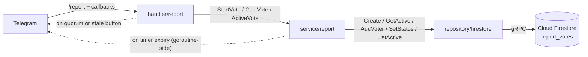
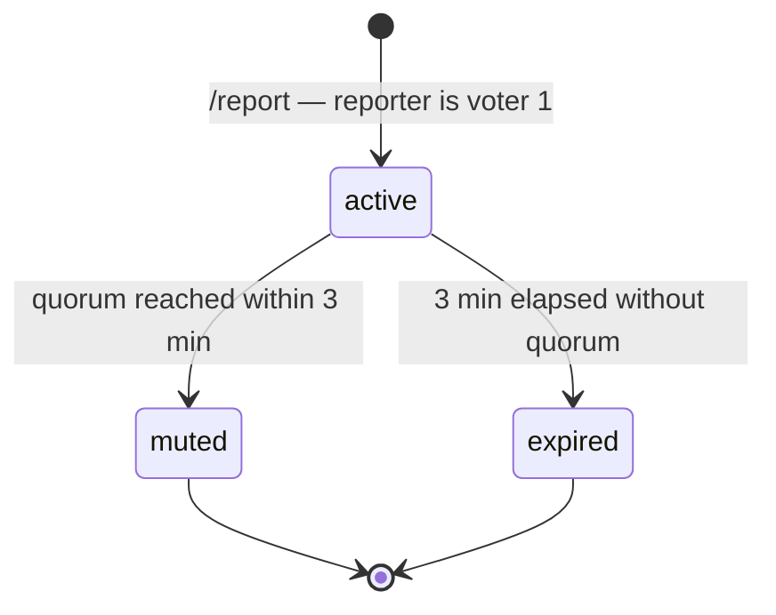
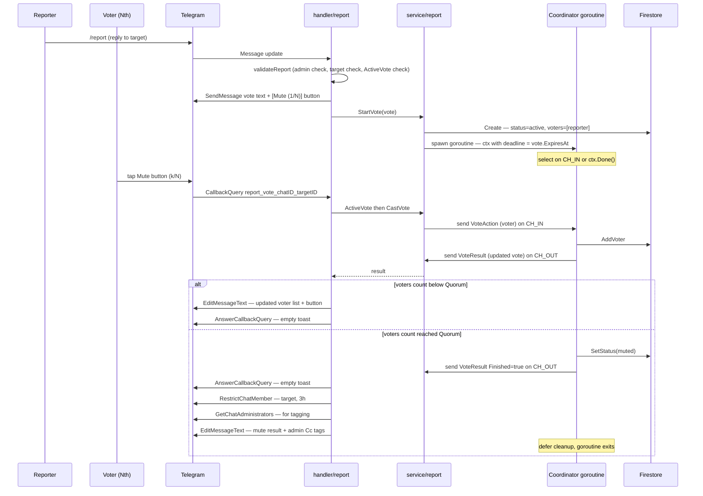
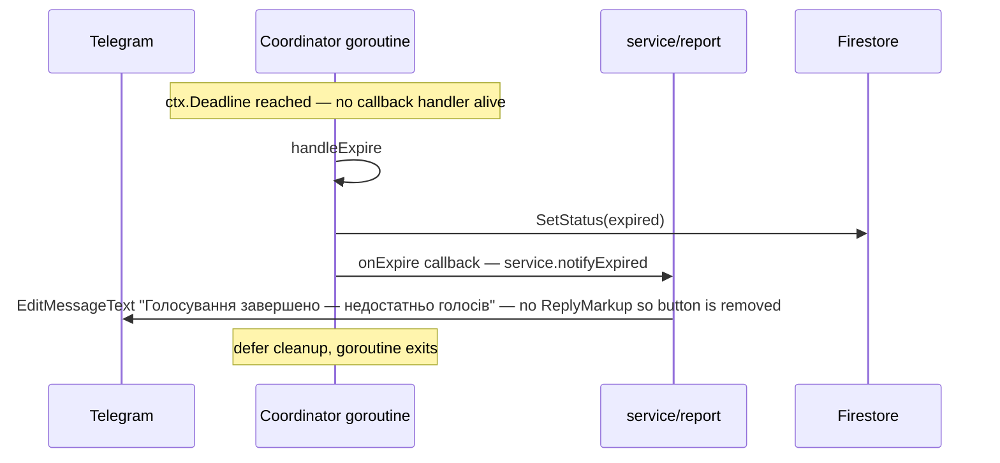
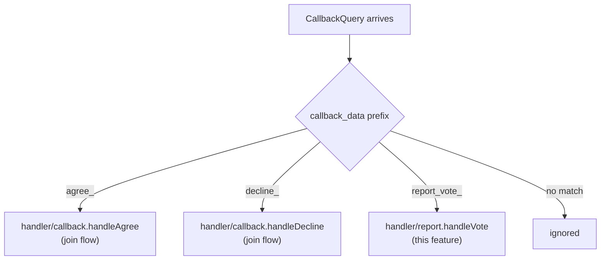
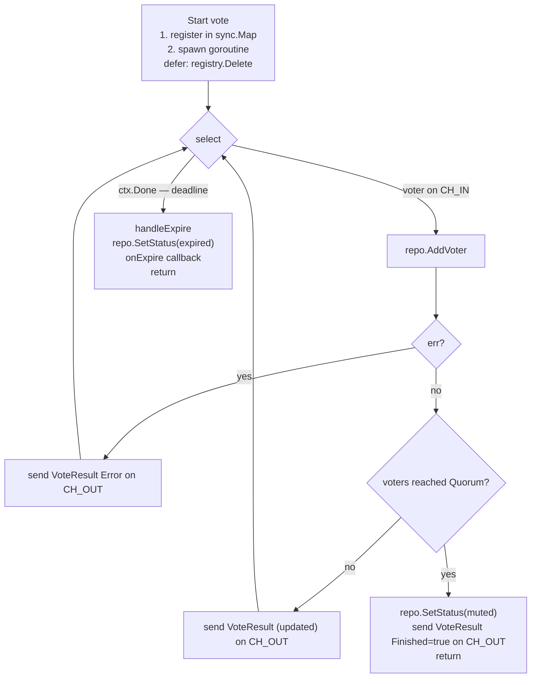
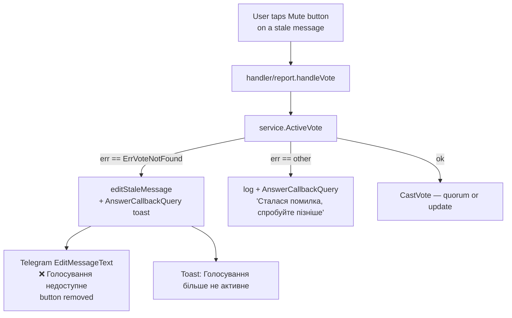
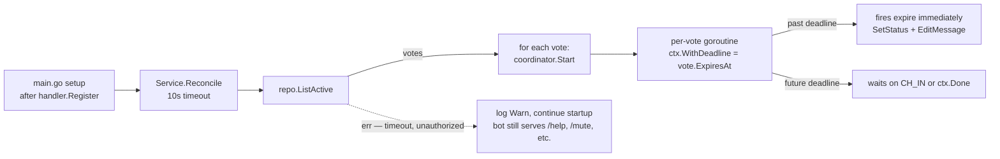

# Community Vote-Mute (`/report`)

Community-driven moderation: any member can reply to a message with `/report` and start a 3-minute vote. If **N** unique members vote `[Mute]`, the target user is muted for 3 hours.

Spec: [issue #104](https://github.com/GolangUA/telegram-butler/issues/104) — simplified scope (no Pardon side, no escalation).

## Packages and responsibilities



- **`handler/report`** — Telegram glue. Validates the command, posts/edits the vote message, routes button callbacks, posts the mute side-effect via `bot.RestrictChatMember`.
- **`service/report`** — business logic. Owns the per-vote `Coordinator` goroutines and the state machine. Also holds the `bot` reference for goroutine-side `EditMessageText` on timer expiry (the one Telegram call no handler is alive to make).
- **`repository/firestore`** — persistence. 5-method `Repository` interface, snake_case schema, 5s per-op timeout.

## Vote lifecycle



- `active` is the only state where the coordinator goroutine runs and the inline button collects taps.
- `muted` / `expired` are terminal. Docs are retained in Firestore for history (composite doc ID `{chatID}_{targetID}_{unixNano}` makes them sortable and inspectable).

## Happy-path: vote reaches quorum



## Expiry path: 3 min passes without quorum



## Callback dispatch

Telegram delivers all inline-button taps as `CallbackQuery` updates. Multiple handler packages register against the same stream — they fan out via telego's `CallbackDataPrefix` predicate.



`report/handler.go:Register` registers `voteGroup := bh.Group(th.CallbackDataPrefix(callbackPrefix))` so this package only sees its own callbacks. The earlier blocker (catch-all join handler swallowing report callbacks) was fixed in `e7565ad` by adopting the same prefix-grouping pattern in `handler/callback`.

## Coordinator goroutine internal loop

The for-select state machine that owns a single active vote from creation until quorum/expiry. One goroutine per active vote, registered in `Coordinator.registry` (a `sync.Map`) and cleaned up by a `defer` on exit.



Note: the goroutine talks to Telegram **only** via the `onExpire` callback (which invokes `service.notifyExpired` → `bot.EditMessageText`). Every other Telegram call happens in the handler goroutine after reading from `CH_OUT`. The expiry edit is the only case where no handler is alive to do it.

## Stale-button edit (orphan recovery)

When the vote's Firestore doc is gone (data wipe, manual cleanup, race orphan) but the Telegram message still has its button, tapping it triggers an explicit "this vote is over" edit instead of doing nothing.



Same branch runs if `CastVote` returns `ErrVoteNotFound` (e.g. coordinator goroutine died between the `ActiveVote` check and the `CastVote` call).

## Startup reconciliation

The Cloud Run instance is ephemeral — restarts happen on deploys, cold-starts, scaling-to-zero. Active votes survive via `Service.Reconcile`:



## Concurrency model

- **One Cloud Run instance** (max instances = 1). No multi-process coordination needed today.
- **One coordinator goroutine per active vote**, keyed in a `sync.Map` by `{chatID}_{targetID}`. Tracked in `Coordinator.registry` (`coordinator.go`).
- **Per-vote serialization** — only the coordinator goroutine writes to that vote's Firestore doc. Callback handlers send via unbuffered channels and wait for the result. No transactions required at the repo layer.
- **Known race** in `validateReport`: two concurrent `/report`s on the same target can both pass the `ActiveVote` gate before either has written. Inline comment + `tasks/2026-05-16-firestore-phase2-progress.md` Phase F #7 document. Not a double-mute risk (only one coordinator collects votes); the orphan auto-expires.

## Timeouts at a glance

| Where | Bound | Why |
|---|---|---|
| Per-Firestore-op | `5s` (`repository/firestore.firestoreOpTimeout`) | Single `/report` or vote tap must fail fast on backend outage |
| Reconcile at startup | `10s` (`cmd/telegram-butler/setup.reconcileTimeout`) | Firestore outage must not block bot startup |
| Vote window | `3m` (`service/report.VoteWindow`) | Spec |
| Mute duration | `3h` (`service/report.MuteDuration`) | Spec |
| Quorum | `5` (`service/report.Quorum`) | Spec (issue #104) |

## Firestore indexing

The `validateReport → ActiveVote` query has 3 equality filters and no `OrderBy` / range:

```go
.Where("chat_id",        "==", X)
.Where("target_user_id", "==", Y)
.Where("status",         "==", "active")
.Limit(1)
```

Firestore satisfies this via **index merging** over auto-created single-field indexes — **no composite index required**. Verified live in `golangua-telegram-butler` against the real `report_votes` collection (no precreated indexes; query succeeded). See [Index types in Cloud Firestore](https://firebase.google.com/docs/firestore/query-data/index-overview).

A composite index would become necessary only if a future change adds:
- A range / inequality filter (e.g. `Where("created_at", ">", t)`)
- An `OrderBy` on a field different from the equality fields
- Operational scale where Firestore deems the merge plan too expensive

If that happens, the first failing query returns `FAILED_PRECONDITION` with an autosuggest URL — click once in the console to create the exact index.

## Failure modes

| Failure | What happens | Visible? |
|---|---|---|
| Firestore unreachable on `/report` | After 5s, handler replies `⚠️ Сервіс тимчасово недоступний` | Yes (chat reply) |
| Firestore unreachable on Reconcile | `Warn` log, bot starts anyway, in-flight votes lost until next restart | Logs only |
| Vote message exists but doc is gone (orphan) | Next button tap edits message to `❌ Голосування недоступне` | Yes (chat edit) |
| Bot restarts mid-vote | Reconcile respawns coordinator; if past deadline, fires expire immediately | Yes (message edited to expired) |
| Concurrent `/report` on same target | Both can pass validation → two docs + two messages; only one collects votes, the other auto-expires | Yes (two messages) |

## File map

```
internal/handler/report/
  handler.go    Telegram entry points (handleReport, handleVote) + edit/delete helpers
  parse.go      callback_data <-> chatID/targetID, voterFromUser
  render.go     HTML formatters (vote text, button, mute result, admin tags)

internal/service/report/
  types.go      Repository interface + VoteAction/VoteResult + Quorum/VoteWindow/MuteDuration
  service.go    StartVote / CastVote / ActiveVote / Reconcile + notifyExpired
  coordinator.go Per-vote goroutine state machine, sync.Map registry
  coordinator_test.go / service_test.go  memory-repo-backed unit tests

internal/repository/firestore/
  client.go     SDK client constructor + type alias
  vote.go       VoteRepository (5 methods, 5s per-op timeout, voteDoc/voterDoc schema)
  vote_test.go  testcontainers-backed integration tests (self-bootstrap emulator)

internal/repository/memory/
  vote.go       sync.Mutex map (test double — production uses repository/firestore)

internal/entity/
  vote.go       Vote, Voter, status constants, ErrVoteNotFound
```
